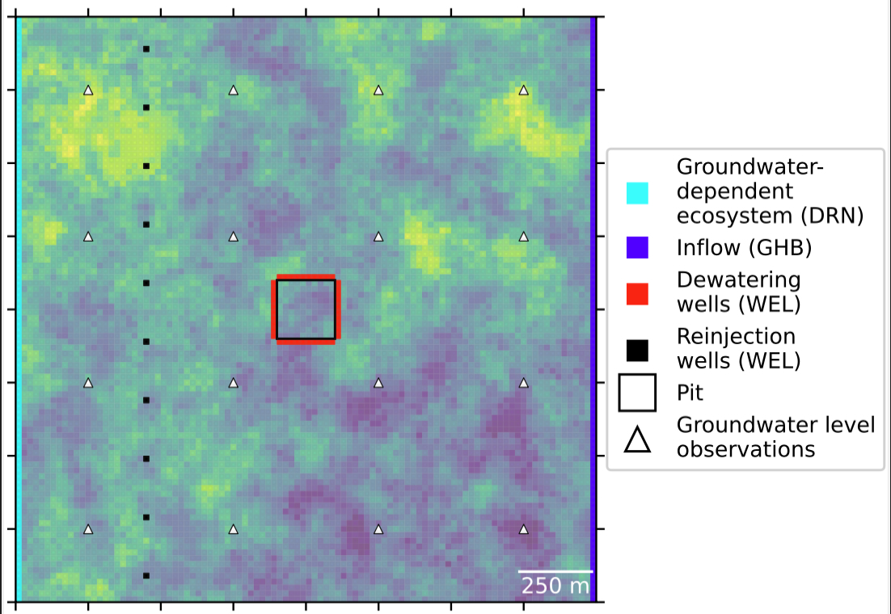

# Theory and Practice of Applied Predictive Groundwater Modeling
Materials and tutorials for the synthetic dewatering model of White and others (2025)

## Installation Instructions

**Download the course repository:**

You can do this in one of two ways. 
 - (1) (easier) Download the repo as a zip file from here: [GMDSI_notebooks](https://github.com/gmdsi/GMDSI_notebooks). Unzip the folder and work from there.
 - (2) (recommended; requires familiarity with git). Install git following directions here: [Git](https://git-scm.com/book/en/v2/Getting-Started-Installing-Git). Sign-up for a GitHub account, then clone the repo [GMDSI_notebooks](https://github.com/gmdsi/GMDSI_notebooks).

**Install Python and dependencies:**
 - If you have already installed Python using Anaconda, you can skip this step. If not, install [miniforge](https://github.com/conda-forge/miniforge?tab=readme-ov-file#download).  
 - If you are using __Windows__: go to the start menu and open "Anaconda prompt". An anaconda command line window will open. On __Linux__ or __MacOS__, just use the standard terminal. Navigate to the course repo folder on your machine. You can accomplish this by typing "cd *your folder path*" and pressing < enter >. Replace *your folder path* with the path to the course material folder on your computer.
 - Next, type `mamba env create -f environment.yml` (or `conda env create -f environment.yml` if `mamba` doesn't work for you). This will create an anaconda environment called "dewater" and install the python dependencies required for this course. It may take a while. Should you wish, you can inspect the *environment.yml* file in the repo folder to see what dependencies are being installed.

**Start jupyter notebook**
You will need to do this step any time you wish to open one of the course notebooks.
To start up the jupyter notebook:
- Windows: open the Anaconda prompt and type `conda activate dewater`
- Mac/Linux: open a termainal and type `conda activate dewater`
- Then navigate to folder where you downloaded the course materials repo and type `jupyter notebook`
A jupyter notebook instance should start within the course repo flder. Using the browser, you can now navigate to the "tutorials" folder and open one and you are in business!
